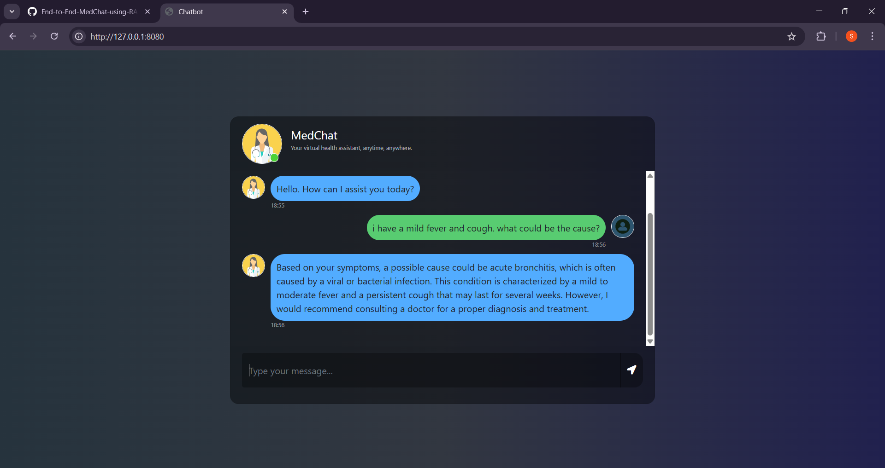

# End-to-End-MedChat-using-RAG

---

---

Tech Stack: Python, LLaMA3-70B, RAG, PineCone, Hugging Face , LangChain

---

## Project Overview

MedChat is an intelligent Generative AI medical chatbot that answers medical queries using a Retrieval-Augmented Generation (RAG) pipeline. It is trained on 10K+ medical entries from textbooks and verified medical sources to ensure high factual accuracy.
The system combines vector-based document retrieval with a large language model (LLaMA3-70B) reasoning layer to generate coherent and medically validated responses.

---

## Features

✅ Answer medical questions with high factual consistency.

✅ Uses PineCone vector database for fast and accurate document retrieval.

✅ Retrieval accuracy >92% in testing.

✅ Generates responses that reference medical textbooks and verified sources.

✅ Can be deployed in AWS or Streamlit 

---

## Architecture

- Data Ingestion : Load and preprocess medical text from textbooks and other sources.

- Vectorization : Convert document chunks into embeddings and store in PineCone.

- RAG Pipeline : Retrieve relevant documents for a user query and generate answers using LLaMA3.

---

## Installation

1. Clone the repository:
   - git clone <your-repo-url>
   - cd End-to-End-MedChat-using-RAG

2. Create a virtual environment:
   - python -m venv .venv

3. Activate the environment:
 Windows CMD:
   - .venv\Scripts\activate.bat
 Windows PowerShell:
   - .venv\Scripts\Activate.ps1
 Mac / Linux:
   - source .venv/bin/activate

4. Install dependencies
   - pip install -r requirements.txt

---

## Environment Variables
- Create a .env file in the project root with your API keys and config. Example:
- PINECONE_API_KEY = "xxxxxxxxxxxxxxxxxxxxx"
- GROQ_API_KEY = "xxxxxxxxxxxxxxxxxxx"

---

## Load it in Python:
- from dotenv import load_dotenv
- load_dotenv()

---

## Running the App
- python app.py
- Open your browser at http://127.0.0.1:8000 for the chatbot interface.

   
      
